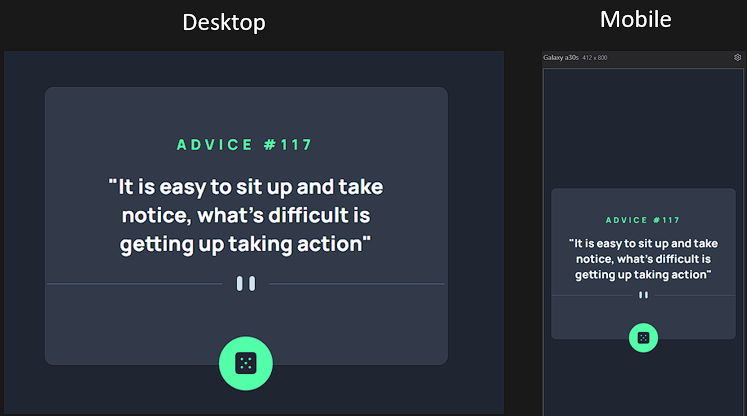

<h1 align="center" >Projeto Advice Generator app</h1>

    

## Sobre
- Um exercício disponibilizado pelo curso "DevQuest" de uma adaptação do site Frontend Mentor para praticar o uso da propriedade Flex.
- Projeto iniciado em 29/08/2024 e revisitado com JavaScript em 09/07/2025 para aplicar os novos aprendizados.

## Tecnologias Utilizadas 
- HTML 
- CSS
- JS

## Responsividade
- Para todos os tipos de dispositivos.

## Dificuldades deste projeto
- A principal dificuldade deste projeto foi centralizar a imagem do dado e criar o efeito de "shadow-box" com o seletor `:hover`. Após alguns testes e revisão sobre `box-shadow`, consegui finalizar o exercício sem mais obstáculos.

- A implementação em JavaScript foi tranquila, e consegui aplicar corretamente o uso da API, separando bem os blocos de código: listeners, variáveis de DOM e funções.

Projeto disponibilizado através do curso <a style="text-decoration: underline; color: white;" target="_blank" href="https://www.instagram.com/devemdobro/">Dev em dobro</a>.
